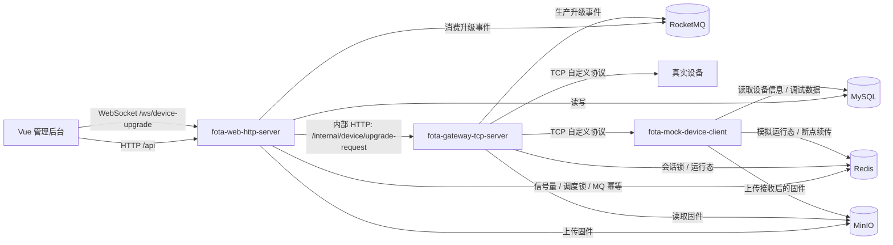
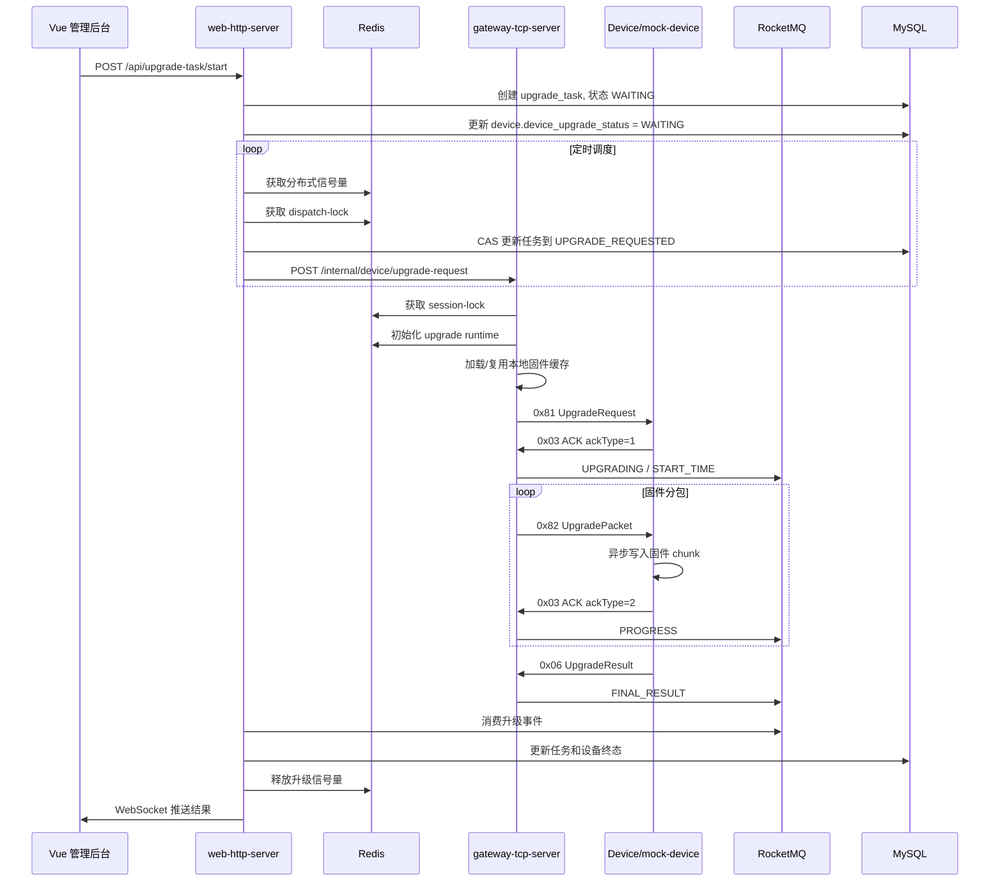

# FOTA 设备固件升级平台

项目主页：https://gitee.com/yf123456/fota-project

FOTA 设备固件升级平台是一套面向 IoT/终端设备的远程固件升级系统。系统提供设备管理、固件包管理、设备固件绑定、单设备升级、批量升级、升级进度追踪、升级日志、模拟设备联调等能力。

项目的核心目标不是简单地把固件文件下载给设备，而是围绕“批量设备、长连接协议、升级并发控制、状态一致性、断点续传、设备背压、升级结果可观测”构建一条完整的 FOTA 升级链路。

## 项目特点

- 管理端与设备网关职责分离：web 服务负责业务编排、权限、数据落库和前端推送；gateway 服务负责 TCP 长连接、自定义协议编解码和固件分包下发。
- 自定义 TCP 协议：支持设备上线、心跳、升级请求、固件分包、设备 ACK、失败上报、取消升级、最终升级结果等消息类型。
- 批量升级并发控制：web 服务通过 Redis 分布式信号量限制同时升级设备数量，通过调度预占锁防止同一设备重复调度。
- 网关升级会话互斥：gateway 服务通过 Redis 会话锁保证同一设备同一时刻只能存在一个升级会话。
- 固件本地缓存：gateway 从 MinIO 加载固件后缓存到 JVM 内存，同一 firmwareId 并发加载时只会有一个线程访问 MinIO。
- RocketMQ 异步事件回传：gateway 只生产升级状态事件，web 服务消费事件后更新数据库并通过 WebSocket 推送前端。
- 模拟设备服务：mock-device 可按需模拟设备上线/下线、接收分包、异步写入固件、触发背压、模拟断点续传。
- Docker Compose 部署：包含 MySQL、Redis、MinIO、RocketMQ、web 服务、gateway 服务、mock-device 服务和 Nginx。

## 技术栈

| 模块 | 技术 |
| --- | --- |
| 前端管理台 | Vue 3, Vite, Element Plus, Axios, Vue Router |
| web HTTP 服务 | Spring Boot 2.6, MyBatis-Plus, MySQL, Redis, RocketMQ, MinIO, WebSocket, JWT |
| gateway TCP 服务 | Spring Boot 2.6, Netty, Redis, RocketMQ, MinIO |
| mock-device 服务 | Spring Boot 3, Netty, Redis, MySQL, MinIO |
| 基础设施 | Docker Compose, MySQL 8, Redis 7, MinIO, RocketMQ, Nginx |
| 构建环境 | JDK 17, Maven, Node.js |

## 仓库结构

```text
fota-project
├── fota-web-admin              # Vue 管理后台
├── fota-web-http-server        # 平台 HTTP 服务，负责业务 API、调度、MQ 消费、WebSocket 推送
├── fota-gateway-tcp-server     # 设备 TCP 网关，负责设备长连接、协议编解码、固件分包
├── fota-mock-device-client     # 模拟设备服务，用于联调升级链路
├── fota-common                 # 公共 DTO、响应对象、升级事件消息
├── ddl                         # MySQL 建表脚本
├── docker                      # Nginx 等 Docker 相关配置
├── rocketmq                    # RocketMQ broker 配置
├── deploy                      # 部署脚本
├── doc                         # 协议、服务、部署说明
├── docker-compose.yml          # 完整部署编排
└── pom.xml                     # Maven 聚合父工程
```

## 总体架构



系统采用“管理平台 + 设备网关 + 消息总线 + 设备模拟器”的架构。web 服务不直接处理 TCP 连接，也不直接执行高频固件分包；gateway 服务不直接落业务库，而是通过 RocketMQ 将升级事件交给 web 服务处理。这样可以降低模块耦合，并把高频设备 IO 与后台管理业务隔离。

## 服务职责

### fota-web-admin

前端管理台，负责提供可视化操作入口。

主要页面：

- 登录与用户权限
- 首页仪表盘
- 设备列表
- 设备分组
- 固件列表与固件上传
- 设备固件绑定
- 单设备升级任务
- 批量升级任务
- 升级日志
- 操作日志
- 模拟设备上线/下线控制

前端通过 Axios 访问 `/api/**`，并通过 `/ws/device-upgrade` 接收实时升级状态。

### fota-web-http-server

平台业务服务，是系统的业务中枢。

核心职责：

- 提供管理后台 REST API。
- 维护设备、设备组、固件包、绑定关系、升级任务、批量任务、用户、操作日志等业务数据。
- 负责 JWT 登录认证和 `/api/**` 接口鉴权。
- 接收前端发起的升级请求，创建 `upgrade_task`，把设备放入等待升级队列。
- 通过 `UpgradeScheduler` 批量调度 WAITING/RETRY_WAITING 任务。
- 通过 Redis 分布式信号量限制全局升级并发。
- 通过 Redis dispatch-lock 防止同一设备被重复调度。
- 调用 gateway 内部 HTTP 接口下发升级请求或取消请求。
- 消费 gateway 发送到 RocketMQ 的升级事件。
- 更新 MySQL 中的设备状态、任务状态、进度、失败原因等。
- 通过 WebSocket 向前端推送实时状态。

### fota-gateway-tcp-server

设备网关服务，是设备侧协议和升级数据传输的核心。

核心职责：

- 启动 Spring Boot HTTP 服务，暴露内部接口给 web 服务调用。
- 启动 Netty TCP Server，维护设备长连接。
- 解析和编码自定义 FOTA 协议。
- 处理设备上线、心跳、ACK、FAIL、UpgradeResult 等上行消息。
- 维护 IMEI 与 Netty Channel 的映射。
- 收到 web 服务下发的升级请求后，校验设备在线状态。
- 通过 Redis session-lock 保证设备升级会话互斥。
- 初始化 Redis 运行态 `fota:upgrade:runtime:{imei}`。
- 从 MinIO 加载固件并缓存到本地 JVM。
- 按 chunkSize 将固件分包，通过 `0x82` 消息下发给设备。
- 根据设备 ACK 控制分包发送进度。
- 将升级开始、升级中、进度、断线、最终结果、取消结果等事件发送到 RocketMQ。

### fota-mock-device-client

模拟设备服务，用于本地和部署环境中验证完整升级链路。

核心职责：

- 提供内部 HTTP 接口，支持平台按设备 IMEI 批量模拟上线/下线。
- 使用 Netty Client 连接 gateway TCP 端口。
- 建连后发送 DeviceBootUp 消息。
- 定时发送心跳。
- 接收 gateway 下发的 `0x81` 升级请求并回复 ACK。
- 接收 `0x82` 固件分包，将 chunk 异步写入本地临时文件。
- 写入成功后回复分包 ACK。
- 收齐分包后合并固件、校验 MD5、上报 `0x06 UpgradeResult`。
- 在本地写入线程池积压时返回 BUSY ACK，触发 gateway 降速。
- 支持模拟升级中下线，再上线后进入断点续传流程。

### fota-common

公共模块，存放多个服务共享的数据结构。

主要包含：

- `ApiResponse`
- `UpgradeEventMessage`
- `UpgradeFailErrorCode`
- 公共异常与事件对象

## 核心升级流程



## 自定义 FOTA TCP 协议

协议整体结构：

```text
+--------+---------+--------+------+-----------+-------+-------------+--------+------+
| head   | version | length | imei | timestamp | seqId | messageType | body   | tail |
| 1 byte | 1 byte  | 4 byte | 8    | 8 byte    | 2     | 1 byte      | N byte | 1    |
+--------+---------+--------+------+-----------+-------+-------------+--------+------+
```

固定规则：

- `head = 0x5B`
- `tail = 0x5D`
- `length` 表示 body 长度
- `messageType` 区分业务消息
- 报文尾部包含 CRC16 校验

消息类型约定：

| messageType | 方向 | 名称 | 说明 |
| --- | --- | --- | --- |
| `0x81` | Platform -> Device | UpgradeRequest | 平台下发升级请求和固件元信息 |
| `0x82` | Platform -> Device | UpgradePacket | 平台下发固件分包 |
| `0x83` | Platform -> Device | Platform ACK | 平台确认关键设备上行消息 |
| `0x87` | Platform -> Device | CancelUpgrade | 平台下发取消升级 |
| `0x10` | Device -> Platform | DeviceBootUp | 设备上线通知 |
| `0x03` | Device -> Platform | Device ACK | 设备 ACK，通过 ackType 表达语义 |
| `0x04` | Device -> Platform | FAIL | 设备上报失败 |
| `0x05` | Device -> Platform | Heartbeat | 心跳 |
| `0x06` | Device -> Platform | UpgradeResult | 设备上报最终升级结果 |

ACK 类型：

| ackType | 名称 | 说明 |
| --- | --- | --- |
| `1` | UPGRADE_REQUEST_ACK | 设备确认收到 `0x81` |
| `2` | PACKET_ACK | 设备确认收到并处理某个 `0x82` 分包 |
| `4` | CANCEL_ACK | 设备确认收到取消升级 |
| `5` | HEARTBEAT | 心跳语义 |
| `6` | BUSY | 设备繁忙，gateway 应降低分包发送速率 |

更详细的协议字段见 `doc/自定义协议格式文档.txt`。

## 升级状态机

任务主链路：

```text
WAITING
  -> RETRY_WAITING
  -> UPGRADE_REQUESTED
  -> UPGRADING
  -> WAIT_RESULT
  -> SUCCESS / FAIL / TIMEOUT / CANCEL_UPGRADE
```

状态说明：

| 状态 | 说明 |
| --- | --- |
| `NO_TASK` | 当前没有升级任务 |
| `WAITING` | 任务已创建，等待调度器下发 |
| `RETRY_WAITING` | 调用 gateway 失败后进入退避重试 |
| `UPGRADE_REQUESTED` | web 已调度，gateway 正在或已经下发 `0x81` |
| `UPGRADING` | 设备已 ACK 升级请求，正在接收固件分包 |
| `WAIT_RESULT` | 分包完成，等待设备最终升级结果 |
| `SUCCESS` | 升级成功 |
| `FAIL` | 升级失败 |
| `TIMEOUT` | 超时 |
| `DISCONNECT` | 升级过程中设备断线 |
| `RESUME_UPGRADING` | 设备重新上线后恢复升级 |
| `CANCEL_UPGRADE` | 升级取消完成 |

web 服务消费 MQ 事件时会按状态机顺序做保护，避免 RocketMQ 重复投递或乱序投递导致终态被运行态覆盖。

## 核心系统设计

### 1. web 服务的分布式信号量

批量升级时，不能一次性把所有设备都推给 gateway，否则会造成设备连接、MinIO、Redis、Netty 发送队列和数据库压力集中爆发。

web 服务使用 Redis Set 实现全局升级信号量：

- key：`fota:upgrade:holders`
- value：设备 IMEI
- 获取：`SCARD < maxActive` 时 `SADD imei`
- 释放：终态事件消费完成后 `SREM imei`

关键点：

- `max-active-devices` 控制同时升级设备数量。
- `dispatch-batch-size` 控制每轮调度最多提交多少设备。
- 信号量由 web 服务获取，也由 web 服务在消费终态事件后释放，避免跨服务释放责任不清。
- 释放时还有 `fota:upgrade:semaphore:released:{taskId}` 保护，避免不同 eventId 的重复终态事件导致重复释放。

### 2. web 服务的升级调度预占锁

仅有信号量还不够。多实例 web 服务或多线程调度时，同一设备可能被重复扫描并调度。

因此 web 服务在调用 gateway 前会先获取 dispatch-lock：

- key：`fota:upgrade:dispatch-lock:{imei}`
- value：`taskId` 作为 lockToken
- TTL：默认 90 秒
- acquire/release 使用 Redis Lua 脚本保证原子性

调度顺序：

```text
获取信号量
  -> 获取 dispatch-lock
  -> DB CAS: WAITING/RETRY_WAITING -> UPGRADE_REQUESTED
  -> 调用 gateway
  -> gateway 受理成功后释放 dispatch-lock
```

如果 CAS 失败，说明任务已经被其它线程或实例处理，立即释放信号量和 dispatch-lock。

### 3. gateway 服务的设备升级会话锁

dispatch-lock 只保护 web 调度阶段。gateway 真正受理 `0x81` 后，需要接管设备升级会话，保证同一设备不会同时进行多个升级。

gateway 使用 session-lock：

- key：`fota:upgrade:session-lock:{imei}`
- value：`taskId` 或 lockToken
- TTL：默认 90 秒
- 支持 acquire、renew、release
- 使用 Redis Lua 脚本保证“只有锁持有者才能续期/释放”

设计目的：

- 防止同一设备重复升级。
- 防止 web 调用异常时误判 gateway 未受理。
- 设备升级过程中可通过续期维持锁。
- 升级终态、取消、异常断线等场景再释放或清理。

gateway 受理升级请求后，还会写入运行态：

```text
fota:upgrade:runtime:{imei}
```

运行态中保存 `taskId`、`firmwareId`、`bucketName`、`objectName`、`packetNo`、`totalPacket`、`chunkSize`、`progress`、`targetFirmwareVersion` 等信息，供分包、断点续传、异常恢复使用。

### 4. gateway 固件分包对象本地缓存管理

固件包存储在 MinIO。如果批量升级 500 台设备都使用同一个固件，不能让 500 个线程同时从 MinIO 拉取同一对象。

gateway 的固件缓存设计包含两个 Map：

```text
firmwareCache:
  firmwareId -> FirmwareCacheHolder

loadingFutureMap:
  firmwareId -> CompletableFuture<FirmwareCacheHolder>
```

加载逻辑：

1. 如果 `firmwareCache` 已存在并且固件字节数组不为空，直接复用。
2. 如果缓存不存在，通过 `loadingFutureMap.computeIfAbsent(firmwareId, ...)` 创建异步加载任务。
3. 同一个 `firmwareId` 并发进入时，只有第一个线程真正访问 MinIO。
4. 其它线程拿到同一个 `CompletableFuture` 等待加载结果。
5. 加载成功后写入 `firmwareCache`，并移除 `loadingFutureMap`。

缓存对象 `FirmwareCacheHolder` 包含：

- `firmwareId`
- `bucketName`
- `objectName`
- `firmwareFullBytes`
- `fileSize`
- `chunkSize`
- `totalPacket`
- `md5`
- `refCount`
- `createdAt`
- `lastAccessAt`

引用计数策略：

- 每台设备命中固件缓存后，`refCount + 1`。
- 设备升级完成、取消或异常结束后，释放引用。
- 定时任务每分钟扫描缓存。
- `refCount <= 0` 且空闲超过 10 分钟，正常释放。
- 空闲超过 30 分钟仍未释放，走强制兜底释放。

当前实现适合中小固件直接放 JVM 内存。若固件体积继续增大，可以演进为本地临时文件、mmap 或分片缓存。

### 5. gateway 固件分包发送设计

gateway 不把整个固件一次性推给设备，而是按固件元数据中的 `chunkSize` 切分：

```text
totalPacket = ceil(fileSize / chunkSize)
packetNo 从 1 递增
每包携带 chunkLength 和 chunkData
```

设备每收到一个 `0x82 UpgradePacket` 后回复 `ackType=2`。gateway 根据 ACK 推进下一包发送，并持续计算进度。

设备返回 `ackType=6 BUSY` 时，表示设备侧写入线程池积压，gateway 应降低发送速率，避免继续压垮设备侧处理能力。

### 6. RocketMQ 升级事件与幂等消费

gateway 不直接写 web 业务库，而是通过 RocketMQ 发送升级事件。

事件类型：

- `START_TIME`
- `UPGRADING`
- `DISCONNECT`
- `PROGRESS`
- `FINAL_RESULT`
- `CANCEL_RESULT`

web 服务消费事件后：

- 使用 `eventId` 做 MQ 幂等。
- 使用 Redis `processingKey` 防止同一事件被多个消费者同时处理。
- 使用 `doneKey` 忽略已经处理完成的事件。
- 对状态流转做顺序校验，防止终态被旧进度消息覆盖。
- 更新 `device` 和 `upgrade_task`。
- 通过 WebSocket 推送给前端。
- 在终态事件中释放升级信号量。

### 7. mock-device 异步线程池写固件

mock-device 收到固件分包后，不在 Netty EventLoop 里直接写文件，而是提交到业务线程池异步处理。

设计原因：

- 文件 IO 是阻塞操作，不能占用 Netty EventLoop。
- 多设备同时升级时，需要控制写入并发。
- 同一个设备/任务的分包写入需要保持局部顺序。
- 写入队列积压时，需要给 gateway 反馈背压。

mock-device 使用分片线程池：

```text
SHARD_COUNT = 8
shardIndex = hash(taskId, imei) % SHARD_COUNT
每个 shard 一个单线程 executor
每个 executor 有固定容量队列
```

效果：

- 同一任务的分包落在同一个 shard，保证写入顺序。
- 不同设备可以分散到不同 shard，并行写入。
- 队列使用率超过阈值时，mock-device 返回 `ackType=6 BUSY`。
- gateway 收到 BUSY 后可以降低发送速率。

mock-device 收齐所有分包后，会合并固件文件，计算 MD5，并通过 `0x06 UpgradeResult` 上报最终结果。

### 8. 断点续传设计

升级过程中设备可能掉线。系统通过 gateway 运行态和 mock-device 运行态记录分包进度。

核心思路：

- gateway 在 Redis runtime 中保存当前任务、当前分包、总包数、固件信息和状态。
- mock-device 在自身 runtime 中保存已写入分包和本地文件进度。
- 设备断线时，gateway 发送 `DISCONNECT` 事件。
- 设备重新上线后，根据 IMEI 和 runtime 信息尝试恢复未完成任务。
- 若断线时间过长或 runtime 已失效，则无法恢复，需要重新发起升级。

前端顶部提示中当前说明为：设备断开连接超过 5 分钟后，再次上线无法进入断点续传状态。

## 数据库设计概览

主要表：

| 表名 | 职责 |
| --- | --- |
| `device` | 设备基础信息、当前固件版本、升级状态、目标固件 |
| `firmware_package` | 固件包元数据、MinIO bucket/object、MD5、分包大小 |
| `device_firmware_binding` | 设备与固件绑定关系 |
| `upgrade_task` | 单设备升级任务主表 |
| `batch_upgrade_task` | 批量升级任务 |
| `upgrade_task_process` | 升级过程异常事件明细 |
| `device_upgrade_log` | 设备升级过程日志 |
| `device_group` | 设备分组树 |
| `device_group_relation` | 设备与设备组关系 |
| `user` | 用户 |
| `user_device_group` | 用户与设备组权限 |
| `operate_log` | 操作日志 |

建表脚本见：

```text
ddl/fota_web_platform.sql
```

## 端口说明

| 服务 | 默认端口 | 说明 |
| --- | --- | --- |
| Nginx | `80` | 前端入口，代理 `/api` 和 `/ws` |
| fota-web-http-server | `8080` | 管理端 HTTP API |
| fota-gateway-tcp-server HTTP | `8081` | gateway 内部 HTTP 接口 |
| fota-gateway-tcp-server TCP | 本地 `7611` / Docker 默认 `8224` | 设备 TCP 长连接端口 |
| fota-mock-device-client | `8082` | 模拟设备控制接口 |
| MySQL | `3306` | 业务数据库 |
| Redis | `6379` | 锁、信号量、运行态 |
| MinIO API | `9000` | 固件对象存储 |
| MinIO Console | `9001` | MinIO 控制台 |
| RocketMQ NameServer | `9876` | MQ NameServer |
| RocketMQ Dashboard | `18082` | MQ 控制台 |

## 本地开发

### 后端构建

```bash
mvn clean package -DskipTests
```

后端模块：

```bash
fota-web-http-server
fota-gateway-tcp-server
fota-mock-device-client
```

启动前需要准备：

- MySQL，并导入 `ddl/fota_web_platform.sql`
- Redis
- MinIO，并配置固件 bucket
- RocketMQ

### 前端开发

```bash
cd fota-web-admin
npm install
npm run dev
```

构建：

```bash
cd fota-web-admin
npm run build
```

### Docker 镜像构建

先构建 jar：

```bash
mvn clean package -DskipTests
```

构建镜像：

```bash
docker build -t fota-web-admin-nginx:v1 -f docker/nginx/Dockerfile .
docker build -t fota-web-http-server:v1 -f fota-web-http-server/Dockerfile .
docker build -t fota-gateway-tcp-server:v1 -f fota-gateway-tcp-server/Dockerfile .
docker build -t fota-mock-device-client:v1 -f fota-mock-device-client/Dockerfile .
```

启动：

```bash
docker compose up -d mysql redis minio rocketmq-namesrv rocketmq-broker rocketmq-dashboard
docker compose up -d fota-web-http-server fota-gateway-tcp-server fota-mock-device-client nginx
```

首次启动 MySQL 时会自动执行：

```text
ddl/fota_web_platform.sql
```

如果 MySQL 数据目录已经初始化过，脚本不会重复执行。需要重新初始化时先清理 `data/mysql`。

## 生产部署建议

推荐启动顺序：

```bash
docker compose up -d mysql redis minio
docker compose up -d rocketmq-namesrv rocketmq-broker rocketmq-dashboard
docker compose up -d fota-web-http-server
docker compose up -d fota-gateway-tcp-server
docker compose up -d fota-mock-device-client
docker compose up -d nginx
```

部署检查项：

- MySQL 表是否初始化完成。
- Redis 是否可连接。
- MinIO bucket 是否创建成功。
- RocketMQ broker 是否成功注册到 nameserver。
- web 服务是否能访问 gateway 内部 HTTP 地址。
- gateway 是否成功监听 TCP 端口。
- mock-device 是否能连接 gateway TCP 地址。
- Nginx `/api/` 和 `/ws/` 是否正确代理到 web 服务。

## 关键配置

web 服务：

```yaml
fota:
  upgrade:
    max-waiting-devices: 5000
    max-active-devices: 500
    dispatch-batch-size: 200

gateway:
  http:
    url: http://fota-gateway-tcp-server:8081
```

gateway 服务：

```yaml
netty:
  server:
    port: 8224

rocketmq:
  topic:
    upgrade-event: FOTA_UPGRADE_EVENT_TOPIC
```

mock-device 服务：

```yaml
netty:
  device-gateway-server:
    host: fota-gateway-tcp-server
    port: 8224
```

## 常见问题

### MySQL 初始化脚本没有执行

MySQL 容器只会在数据目录第一次初始化时执行 `/docker-entrypoint-initdb.d` 下的 SQL。若已经启动过，需要清理数据目录后重新启动。

```bash
docker compose down
rm -rf ./data/mysql
docker compose up -d mysql
```

### RocketMQ broker 启动失败

如果出现 `ScheduleMessageService.configFilePath` 或 `delayOffset.json` 相关错误，通常是 broker store 目录权限或残留数据问题。

可尝试：

```bash
docker compose stop rocketmq-broker
sudo rm -rf data/rocketmq/broker/store
sudo mkdir -p data/rocketmq/broker/store
sudo chmod -R 777 data/rocketmq/broker
docker compose up -d rocketmq-broker
```

### 升级任务一直 WAITING

排查方向：

- web 服务调度器是否启动。
- `fota.upgrade.max-active-devices` 是否已经被信号量占满。
- Redis `fota:upgrade:holders` 是否存在未释放 IMEI。
- 设备是否在线。
- gateway HTTP 地址是否可达。
- 任务是否因为重试进入 `RETRY_WAITING`。

### 设备不在线，无法下发升级请求

排查方向：

- mock-device 是否已经模拟上线。
- gateway TCP 端口是否正确暴露。
- `SessionManager` 是否有当前 IMEI 对应的 Channel。
- 设备上线后是否发送了 `DeviceBootUp`。

### 固件分包速度慢

可能原因：

- mock-device 返回 BUSY，gateway 主动降速。
- mock-device 写文件线程池队列积压。
- 固件 chunkSize 太小导致包数过多。
- gateway 固件缓存未命中，首次加载需要从 MinIO 读取。

## 后续可演进方向

- 将 gateway 固件缓存从 JVM byte array 演进为本地文件或 mmap，支持更大固件。
- WebSocket 多实例广播可引入 Redis Pub/Sub 或 MQ fanout。
- RocketMQ topic 和 consumer group 注解配置进一步参数化，便于多环境部署。
- 升级按钮增加用户级限流，例如同一用户 3 分钟内限制重复发起。
- 增加更完整的升级任务超时扫描和异常补偿。
- 补充协议兼容版本控制，支持多协议版本设备平滑升级。
- 增加单元测试和集成测试覆盖核心状态机、锁释放、MQ 幂等、缓存引用计数等逻辑。
