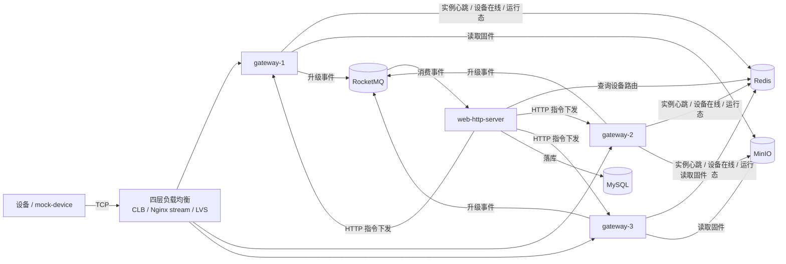
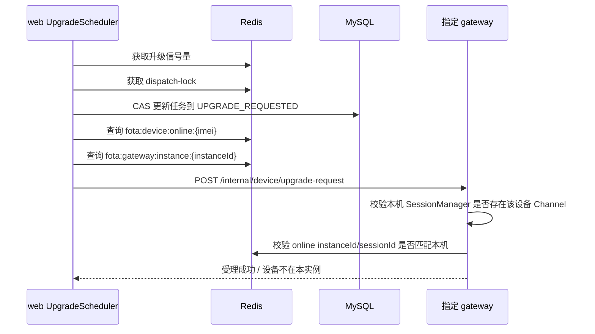
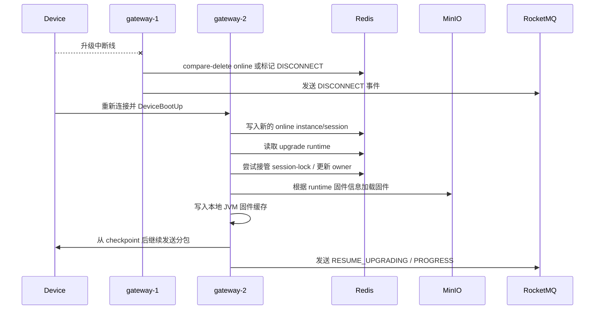

# 多实例设备网关设计方案

## 1. 背景

当前 FOTA 项目已经打通核心设备升级链路：

- web 服务负责设备、固件、任务、调度、状态落库和 WebSocket 推送。
- gateway 服务负责设备 TCP 长连接、自定义协议解析、固件分包下发。
- gateway 通过 RocketMQ 将升级状态事件回传给 web 服务。
- Redis 承担升级信号量、调度预占锁、升级会话锁和运行态缓存。
- MinIO 作为固件包统一对象存储。

现阶段部署方式仍偏单机网关：设备连接到唯一 gateway 实例，web 服务下发升级指令时也只需要调用固定 gateway 地址。

当 gateway 扩展为多实例后，会出现几个新问题：

- 设备上线后连接到了哪一台 gateway？
- web 服务如何把升级指令下发到“设备当前所在的 gateway 实例”？
- 设备断线后重连到另一台 gateway，如何继续断点续传？
- gateway 本地 JVM 固件缓存无法跨实例共享，跨实例恢复时如何重新加载固件？
- 旧 gateway 的残留任务如何避免继续发送分包？
- 多 gateway 扩缩容、故障摘除、权重和连接均衡如何处理？

本文档给出多实例 gateway 的系统设计方案。

## 2. 设计目标

### 2.1 功能目标

- 支持多个 gateway 实例同时运行。
- 支持设备通过负载均衡连接任意 gateway 实例。
- 支持 web 服务按 IMEI 精确定位设备当前连接的 gateway 实例。
- 支持 web 服务将升级、取消升级等指令下发到具体 gateway 实例。
- 支持设备断线后重连到另一 gateway 实例，并继续断点续传。
- 支持 gateway 实例上下线、故障失联后的路由自动失效。
- 保持现有升级调度、分布式信号量、调度预占锁、升级会话锁的整体模型不变。

### 2.2 非目标

第一阶段不做以下能力：

- gateway 之间直接转发 TCP 消息。
- gateway 本地 JVM 固件缓存跨实例共享。
- 设备端直接感知 gateway 列表并自行做一致性哈希。
- 强依赖 IMEI 取模实现设备固定分片。

## 3. 总体架构

推荐架构如下：



核心原则：

- 设备连接归属由 gateway 上报到 Redis。
- web 服务下发前查 Redis，不通过 IMEI 取模猜测设备位置。
- Redis 中的设备在线路由是“当前事实来源”。
- Redis 中的升级 runtime 是断点续传的“权威运行态”。
- gateway 本地 JVM 固件缓存只是性能优化，不作为跨实例状态来源。

## 4. 设备如何选择 gateway

### 4.1 推荐方案：四层负载均衡

推荐让设备连接统一 TCP 入口：

```text
设备 -> 腾讯云 CLB / Nginx stream / LVS -> gateway 多实例
```

负载策略推荐顺序：

1. 加权最少连接。
2. 加权轮询。
3. 普通轮询。

推荐原因：

- gateway 扩缩容时设备端无需改配置。
- gateway 故障摘除由负载均衡层处理。
- 支持权重，方便灰度、扩容和压测。
- 不要求设备具备复杂的服务发现能力。

### 4.2 不推荐第一阶段使用 IMEI 取模

不建议第一阶段使用：

```text
gatewayIndex = imei % gatewayCount
```

原因：

- gateway 实例数变化会导致大量设备重新映射。
- 某个 gateway 故障时，取模规则需要整体变化。
- 权重支持困难。
- 灰度发布和临时摘除不方便。
- 设备端需要知道 gateway 实例列表，增加设备侧复杂度。

如果未来设备端能力增强，可以考虑一致性哈希，而不是简单取模。但第一阶段建议先使用负载均衡 + Redis 设备路由表。

## 5. gateway 实例注册

每个 gateway 实例启动后，需要向 Redis 注册自身。

### 5.1 instanceId

每个 gateway 实例需要有唯一 `instanceId`。

建议格式：

```text
gateway-{hostName}-{tcpPort}-{startupTimestamp}
```

或容器环境中使用：

```text
gateway-{containerName}-{podIp}-{startupTimestamp}
```

如果未来接入 Kubernetes，可使用 Pod Name 或 StatefulSet ordinal。

### 5.2 实例注册 Key

```text
fota:gateway:instances
```

类型：Set

内容：

```text
gateway-1
gateway-2
gateway-3
```

实例详情：

```text
fota:gateway:instance:{instanceId}
```

类型：Hash

字段：

| 字段 | 说明 |
| --- | --- |
| `instanceId` | gateway 实例 ID |
| `httpUrl` | web 服务调用该 gateway 的 HTTP 地址 |
| `tcpHost` | gateway TCP host |
| `tcpPort` | gateway TCP port |
| `status` | `UP` / `DRAINING` / `DOWN` |
| `weight` | 权重 |
| `activeConnections` | 当前活跃连接数 |
| `startedAt` | 启动时间 |
| `lastHeartbeatAt` | 最近心跳时间 |

TTL 推荐：

```text
30s
```

gateway 每 10 秒续期一次。

### 5.3 实例状态

| 状态 | 说明 |
| --- | --- |
| `UP` | 正常接收设备连接和升级任务 |
| `DRAINING` | 准备下线，不再接收新的升级指令，但保留已有连接 |
| `DOWN` | 不可用 |

第一阶段可以只实现 `UP` 和实例 TTL 失效。

## 6. 设备在线路由注册

设备完成 `DeviceBootUp` 后，当前 gateway 写入设备在线路由。

### 6.1 在线 Key

```text
fota:device:online:{imei}
```

类型：Hash

字段：

| 字段 | 说明 |
| --- | --- |
| `imei` | 设备 IMEI |
| `instanceId` | 当前连接的 gateway 实例 |
| `sessionId` | 当前 TCP Channel 会话 ID |
| `channelId` | Netty Channel ID |
| `connectedAt` | 本次连接建立时间 |
| `lastSeenAt` | 最近心跳或上行消息时间 |
| `deviceType` | 设备类型 |
| `currentFirmwareVersion` | 当前固件版本 |
| `remoteAddress` | 设备远端地址 |

TTL 推荐：

```text
240s
```

当前 gateway 在收到设备心跳或关键上行消息时续期。

### 6.2 sessionId 的必要性

多实例场景必须引入 `sessionId`。

典型竞态：

```text
1. 设备连接 gateway-1，Redis online 指向 gateway-1/session-A
2. 设备断线并快速重连 gateway-2，Redis online 指向 gateway-2/session-B
3. gateway-1 的 channelInactive 晚到
4. 如果 gateway-1 直接 delete online key，会误删 gateway-2 的新连接
```

因此删除或续期在线路由时必须做 fencing 判断：

```text
只有 Redis 中 sessionId == 当前 Channel sessionId，才允许续期或删除。
```

建议使用 Lua 脚本保证原子性。

### 6.3 删除在线路由

gateway 收到 `channelInactive` 时执行 compare-and-delete：

```lua
if redis.call('hget', KEYS[1], 'sessionId') == ARGV[1] then
    return redis.call('del', KEYS[1])
end
return 0
```

这样旧连接不会误删新连接。

## 7. web 服务下发指令路由

web 服务不再配置单一 gateway 地址，而是通过 `GatewayRouteService` 定位设备当前 gateway。

### 7.1 下发升级流程



### 7.2 web 路由逻辑

伪代码：

```java
GatewayRoute route = gatewayRouteService.findRouteByImei(imei);
if (route == null) {
    throw new BusinessException("设备不在线");
}

GatewayApiResponse<Void> response = callGateway(route.getHttpUrl(), request);

if (response.code == DEVICE_NOT_ON_THIS_GATEWAY) {
    GatewayRoute latestRoute = gatewayRouteService.findRouteByImei(imei);
    if (latestRoute != null && !latestRoute.equals(route)) {
        callGateway(latestRoute.getHttpUrl(), request);
    }
}
```

最多重试一次即可，避免设备频繁重连时造成调度线程长时间阻塞。

### 7.3 gateway 侧校验

gateway 收到 web 下发请求后必须校验：

- 本机 `SessionManager` 是否存在该 IMEI。
- Channel 是否 active。
- 本机 Channel 的 `sessionId` 是否与 Redis online key 一致。
- online key 中的 `instanceId` 是否等于本机 `instanceId`。

如果不满足，返回：

```text
DEVICE_NOT_ON_THIS_GATEWAY
```

web 收到该错误后重新查询路由。

## 8. 升级会话锁与 owner fencing

多实例场景下，升级互斥仍由 Redis session-lock 保证。

### 8.1 session-lock

```text
fota:upgrade:session-lock:{imei}
```

value：

```text
lockToken，一般为 taskId
```

用途：

- 防止同一设备并发升级。
- 防止设备重连过程中多个 gateway 同时接管同一任务。
- 防止旧 gateway 在失去设备归属后继续发送分包。

### 8.2 runtime owner

升级 runtime 中增加 owner 字段：

```text
fota:upgrade:runtime:{imei}
```

新增字段：

| 字段 | 说明 |
| --- | --- |
| `ownerInstanceId` | 当前负责该升级任务的 gateway 实例 |
| `ownerSessionId` | 当前负责该升级任务的设备连接 session |
| `lastAckPacketNo` | gateway 视角最后收到 ACK 的分包号 |
| `lastSentPacketNo` | gateway 视角最后发送的分包号 |
| `resumeExpireAt` | 断点续传允许恢复的截止时间 |

gateway 每次发送分包前都要检查：

```text
runtime.ownerInstanceId == localInstanceId
runtime.ownerSessionId == localSessionId
```

不匹配则停止发送，并释放本地固件缓存引用。

这是一种 fencing token 机制，可以避免旧 gateway 残留任务继续写旧 Channel。

## 9. 断点续传跨实例设计

### 9.1 核心原则

跨实例断点续传不能依赖 gateway 本地 JVM 缓存。

权威状态必须来自：

- Redis `fota:upgrade:runtime:{imei}`
- MySQL `upgrade_task`
- MinIO 固件对象
- 设备上报的恢复 checkpoint

gateway 本地 JVM 固件缓存只是性能优化。设备从 gateway-1 重连到 gateway-2 时，gateway-2 重新从 MinIO 加载固件到自己的 JVM 缓存是正常行为。

### 9.2 跨实例恢复流程



### 9.3 checkpoint 来源

建议设备上线或心跳中补充当前升级 checkpoint：

```text
taskId
upgradeStatus
lastReceivedPacketNo
firmwareMd5 或 firmwareId
```

可以选择：

- 扩展 `DeviceBootUp`。
- 新增 `ResumeReport` 上行消息。
- 扩展 Heartbeat body。

推荐新增 `ResumeReport`，语义更清晰，对现有上线消息影响较小。

### 9.4 恢复分包位置

恢复时建议使用更保守的位置：

```text
resumePacketNo = min(redisLastAckPacketNo, deviceLastReceivedPacketNo)
nextPacketNo = resumePacketNo + 1
```

原因：

- Redis 记录的是 gateway 视角的 ACK。
- 设备记录的是设备真实落盘或处理进度。
- 两者可能因为网络断开、ACK 丢失、进程重启而不完全一致。

设备端需要保证 packet 写入幂等：

- 重复 packetNo 可以覆盖写入。
- 已处理 packetNo 可以直接 ACK。
- 最终以完整文件 MD5 校验作为正确性兜底。

## 10. 固件缓存跨实例处理

### 10.1 当前缓存模型

gateway 当前使用：

```text
firmwareCache:
  firmwareId -> FirmwareCacheHolder

loadingFutureMap:
  firmwareId -> CompletableFuture<FirmwareCacheHolder>
```

同一个 gateway 实例内，同一个 firmwareId 并发加载时，只允许一个线程访问 MinIO，其它线程等待同一个 Future。

### 10.2 多实例下的行为

多实例下，每个 gateway 都有自己的 JVM 缓存：

```text
gateway-1 firmwareCache
gateway-2 firmwareCache
gateway-3 firmwareCache
```

跨实例断点续传时：

```text
gateway-2 发现本地没有 firmwareId 缓存
  -> 根据 runtime 中的 bucketName/objectName 从 MinIO 重新加载
  -> 写入 gateway-2 本地 JVM 缓存
  -> 从 checkpoint 继续分包
```

这是预期行为。

### 10.3 后续演进

如果固件体积变大或 MinIO 压力较高，可以演进为：

- gateway 本地磁盘缓存。
- mmap 文件映射。
- 固件预热接口。
- CDN 或对象存储就近加速。
- 分片缓存，只缓存当前窗口附近的 chunk。

第一阶段无需实现跨实例共享缓存。

## 11. 关键竞态与处理

### 11.1 web 查到旧 gateway，设备已重连新 gateway

场景：

```text
web 查到 imei -> gateway-1
设备断线并重连 gateway-2
web 调用 gateway-1
```

处理：

- gateway-1 校验本机 Channel 和 Redis online owner。
- 不匹配则返回 `DEVICE_NOT_ON_THIS_GATEWAY`。
- web 重新查询 Redis online key。
- web 调用 gateway-2，最多重试一次。

### 11.2 旧 gateway channelInactive 晚到，误删新连接

处理：

- online key 删除必须 compare sessionId。
- 只有 sessionId 匹配旧 Channel，才允许删除。

### 11.3 旧 gateway 残留发送任务继续发包

处理：

- runtime 增加 `ownerInstanceId` 和 `ownerSessionId`。
- 每次发送分包前做 owner fencing 校验。
- 校验失败立即停止发送并释放本地缓存引用。

### 11.4 gateway 已受理升级，但 web HTTP 调用超时

处理：

- web catch 异常后检查 session-lock 或 runtime。
- 如果 runtime.taskId 已存在且 lockToken 匹配，说明 gateway 已受理。
- web 不进入重试，避免重复下发。

### 11.5 终态事件重复投递

已有处理可以继续复用：

- `eventId` 做 MQ 消息幂等。
- `fota:upgrade:semaphore:released:{taskId}` 做业务维度信号量释放幂等。
- 状态机顺序保护，防止终态被旧进度覆盖。

## 12. 接口调整建议

### 12.1 gateway 内部升级接口响应码

当前 gateway 内部接口可以扩展业务错误码：

| code | 说明 |
| --- | --- |
| `0` | 成功 |
| `DEVICE_OFFLINE` | 设备不在线 |
| `DEVICE_NOT_ON_THIS_GATEWAY` | 设备当前不在本 gateway |
| `UPGRADE_SESSION_EXISTS` | 设备升级会话已存在 |
| `FIRMWARE_CACHE_LOAD_FAILED` | 固件缓存加载失败 |
| `FIRMWARE_CACHE_LOAD_TIMEOUT` | 固件缓存加载超时 |

web 服务对 `DEVICE_NOT_ON_THIS_GATEWAY` 做一次路由刷新重试。

### 12.2 新增 gateway 实例列表接口

可选，用于运维和前端观察：

```text
GET /internal/gateway/instances
```

返回当前 Redis 中的 gateway 实例信息。

### 12.3 新增设备路由查询接口

可选：

```text
GET /internal/device-route/{imei}
```

也可以只在 web 服务内部通过 Redis 查询，不暴露接口。

## 13. 代码改造建议

### 13.1 gateway 新增组件

建议新增：

```text
GatewayInstanceProperties
GatewayRegistryService
DeviceOnlineRegistry
DeviceSessionIdGenerator
GatewayOwnershipService
```

职责：

- `GatewayRegistryService`：注册 gateway 实例、心跳续期、下线清理。
- `DeviceOnlineRegistry`：设备上线注册、心跳续期、断线 compare-delete。
- `GatewayOwnershipService`：判断当前实例是否仍拥有某设备连接和升级任务。

### 13.2 web 新增组件

建议新增：

```text
GatewayRouteService
GatewayRoute
RoutedPlatformCommandService
```

职责：

- `GatewayRouteService`：根据 IMEI 查询 online key 和 gateway instance key。
- `RoutedPlatformCommandService`：按路由调用具体 gateway HTTP 地址，并处理一次路由刷新重试。

### 13.3 DTO 调整

`PlatformUpgradeRequest` 建议补充：

```text
expectedInstanceId
expectedSessionId
```

gateway 可以用它做更严格的请求 fencing。

## 14. 分阶段实施计划

### 阶段一：设备路由表

- gateway 增加 instanceId。
- gateway 注册实例心跳。
- gateway 在 DeviceBootUp 后写入 `fota:device:online:{imei}`。
- gateway 在 channelInactive 时 compare-delete online key。
- web 下发升级前改为查询设备 online key。

验收：

- 两个 gateway 实例同时启动。
- mock-device 随机连接其中一个 gateway。
- web 能将升级请求下发到正确 gateway。

### 阶段二：下发请求 fencing

- gateway 内部 HTTP 接口校验本机 Channel、instanceId、sessionId。
- web 对 `DEVICE_NOT_ON_THIS_GATEWAY` 做一次路由刷新重试。
- runtime 增加 ownerInstanceId、ownerSessionId。
- 分包发送前增加 owner fencing。

验收：

- 设备重连过程中 web 下发升级，不会发到旧 gateway。
- 旧 gateway 不会继续发送分包。

### 阶段三：跨实例断点续传

- runtime 完善 lastAckPacketNo、lastSentPacketNo、resumeExpireAt。
- gateway 新实例上线后可读取 runtime 并接管任务。
- gateway 新实例可重新加载固件缓存。
- 设备补充 ResumeReport 或等价 checkpoint。

验收：

- 设备升级中连接 gateway-1。
- 断线后重连 gateway-2。
- gateway-2 重新加载固件，并从 checkpoint 继续发送。

### 阶段四：运维能力

- gateway 实例列表观测。
- 活跃连接数统计。
- gateway DRAINING 状态。
- 指标监控和告警。
- CLB 权重调整和灰度验证。

## 15. 推荐最终链路

最终升级下发链路：

```text
web UpgradeScheduler
  -> Redis 分布式信号量
  -> Redis dispatch-lock
  -> DB CAS 到 UPGRADE_REQUESTED
  -> GatewayRouteService 查询 imei 当前 gateway
  -> HTTP 调用目标 gateway
  -> gateway 校验本机设备 Channel 和 Redis owner
  -> gateway 获取 session-lock
  -> gateway 初始化/接管 runtime
  -> gateway 加载本地固件缓存
  -> gateway 下发 0x81 / 0x82
  -> gateway 生产 MQ 事件
  -> web 消费事件落库并推送 WebSocket
  -> 终态释放 Redis 分布式信号量
```

最终跨实例恢复链路：

```text
设备断线
  -> 旧 gateway 标记 DISCONNECT
  -> 设备重连到新 gateway
  -> 新 gateway 注册 online owner
  -> 新 gateway 读取 runtime
  -> 新 gateway 接管 session-lock 和 runtime owner
  -> 新 gateway 从 MinIO 重新加载固件到本地 JVM
  -> 新 gateway 从 checkpoint 继续分包
```

## 16. 总结

多实例 gateway 的关键不是让 web 服务用 IMEI 取模去推测设备位置，而是建立一张实时设备路由表：

```text
imei -> gatewayInstanceId + sessionId
```

web 服务只根据这张路由表下发指令。gateway 在接收指令时必须再次校验本机 ownership，防止竞态。断点续传的权威状态必须放在 Redis runtime、MySQL 和设备 checkpoint 中，本地 JVM 固件缓存只做性能优化。设备跨实例重连后，新 gateway 根据 runtime 和 MinIO 重新加载固件，并从 checkpoint 继续发送分包。

这套设计可以在尽量保留当前系统模型的前提下，把单机 gateway 平滑演进为多实例 gateway。
